<p align="center">
  
</p>

<br/>

---

## About

Computer Science student at the University of Dhaka, focused on building systems that sit at the intersection of full-stack engineering and applied machine learning. I work across the entire development lifecycle — from model training and API design to user-facing interfaces. Currently deep in the world of large language models, generative AI, and cloud-native architecture.

<br/>

---

## Featured Work

<br/>

**GrocyGenie AI Model** &nbsp; [`View Repository`](https://github.com/shahriarkabir280/GrocyGenieModel)

Predictive model that forecasts grocery depletion dates by analyzing historical purchase and consumption patterns. Built with TensorFlow and deployed via Hugging Face, it powers the smart-restock engine inside the GrocyGenie mobile application.

```
Stack  →  TensorFlow · Python · Hugging Face · Google Colab
Type   →  Time-series prediction · Mobile-integrated ML model
```

<br/>

---

## Technical Stack

<br/>

**Languages**


<br/>

**Frontend**


<br/>

**Backend & Databases**


<br/>

**AI / ML**


<br/>

**Tooling**


<br/>

---

## Currently Learning

```
  Large Language Models (LLMs) & Generative AI
  Advanced Machine Learning Techniques
  Cloud Architecture & DevOps
```

<br/>

---

## Competitive Programming

Consistent problem-solver across multiple platforms. Available under the handle **Dopamine_01**.

<br/>

[](https://leetcode.com/u/Dopamine_01/)
[](https://codeforces.com/profile/Dopamine_01)
[](https://www.codechef.com/users/dopamine_01)

<br/>

---

## GitHub Stats

<br/>

<p align="center">
  
  &nbsp;&nbsp;
  
</p>

<p align="center">
  
</p>

<br/>

---

## Connect

<br/>

[](https://linkedin.com/in/shahriar-kabir25)
[](mailto:shahriarkabir280@gmail.com)
[](https://github.com/shahriarkabir280)
[](https://leetcode.com/u/Dopamine_01/)

<br/>

---

<p align="center">
  
</p>
